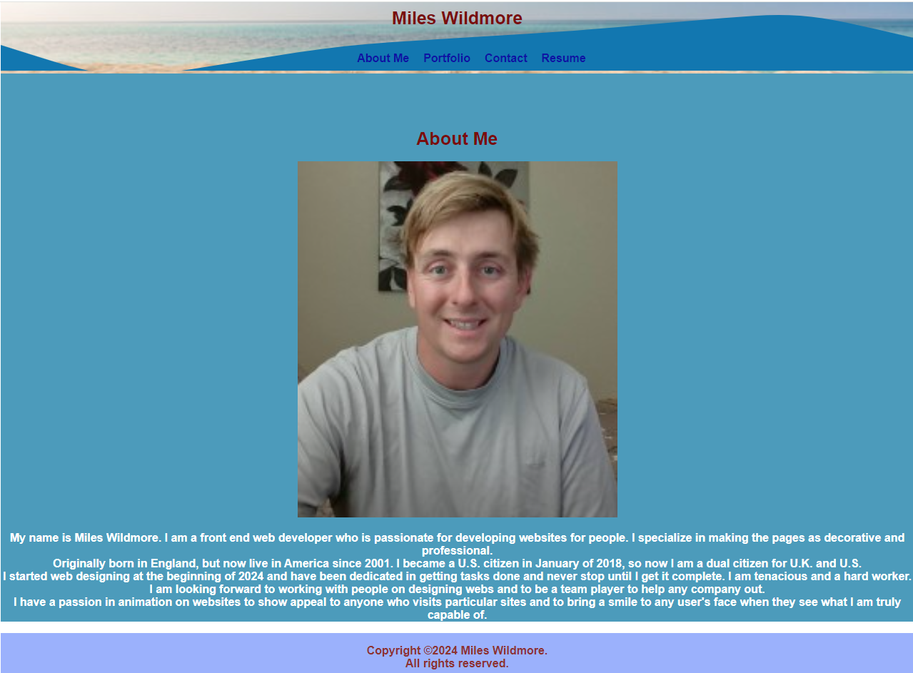

# React Portfolio



## Description
Welcome to my portfolio! You will get a chance to see what I am all about and what I have learned thoughtout my experience of coding for websites. You also will get a chance to learn all about me and be able to explore projects I made with my team. Here I used a new tool known as React to make my portfolio professional for people to view my projects I made since the beginning of the year. While building my portfolio, I learned about how to use React to add more effects to my page, such as connecting the header, navigation bar, and footer to different pages within one file. I also featured a new animation technique to make my pages very appealing to look at as well as showing what I am capable of creating. I also learned how to connect my navigation pages with react routing to connect to other pages and to keep the codes simple and easier to navigate throughout my React portfolio page. I look forward to working with employees to build websites and to show my skills to companies!

## Link
https://mileswildmore.netlify.app

## Table of Contents
 * [Description](#description)
 * [Installation](#installation)
 * [Usage](#usage)
 * [License](#license)
 * [Contributing](#contributing)
 * [Tests](#tests)
 * [Questions](#questions)
 * [Resources](#resources)

## Installation
You will need these npm (Node Package Manager) in order to view my portfolio. You will navigate to the root of the directory of the package.json file, navigate to "Open in Integrated Terminal" and enter these commands to install the packages:
```
npm install
npm run start


```


## Usage
You can use the "Node.js" terminal to check out my portfolio, and checkout information about me and the projects I made within my time working on coding.

## License
This project is licensed with MIT

## Contributing
All the contributions to this project is all done by Miles Wildmore


## Tests

To test out my portfolio, you will need to run the server by typing this in the terminal and open the localhost from the root directory with this command: 
```
npm run start

```

If you want to leave my porfolio in the terminal, hold "CTRL+C" ("CMD+C" for Mac) to stop hosting localhost.

## Resources

Link to npm page : https://www.npmjs.com/

Link to more information on React: https://react.dev/

Link to get node.js: https://nodejs.org/

## Questions
If you would like contact me for further information, be sure to reach out to me at mileswildmore@hotmail.com

If you would like to know how to setup dependencies, check out my repo at https://github.com/mileswildmore18